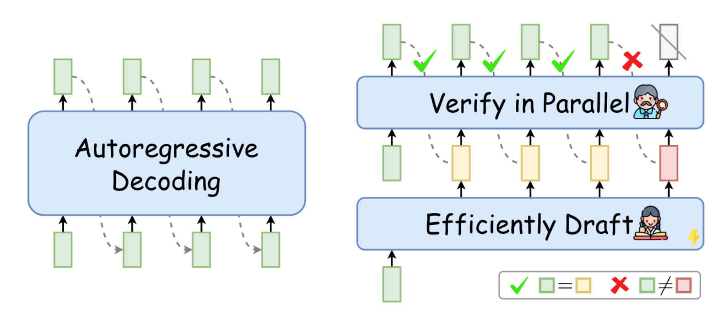
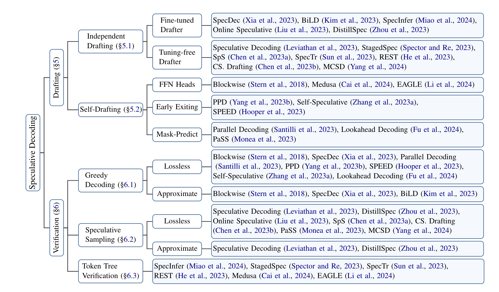

# Awesome-Speculative-Decoding

## 🔍 What is Speculative Decoding
Speculative Decoding is a Draft-thenVerify decoding paradigm in which, at each decoding step, it first efficiently drafts multiple future tokens and then verifies all these tokens in parallel using the target LLM to speed up inference.

## 🌟 Why Speculative Decoding
Transformer-based LLMs generate one token at a time, which significantly limits their inference speed. To accelerate the inference speed of LLMs, Speculative Decoding was introduced. Speculative Decoding employs a draft model to generate multiple tokens simultaneously and utilizes an LLM verification strategy to expedite the inference process.

## 🔍 Resources
A collection of papers of Speculative Decoding

### Surveys
**Unlocking Efficiency in Large Language Model Inference: A Comprehensive Survey of Speculative Decoding** 
Heming Xia, Zhe Yang, Qingxiu Dong, Peiyi Wang, Yongqi Li, Tao Ge, Tianyu Liu, Wenjie Li, Zhifang Sui. [[paper](https://arxiv.org/abs/2401.07851)]

**Beyond the Speculative Game: A Survey of Speculative Execution in Large Language Models** 
Chen Zhang, Zhuorui Liu, Dawei Song. [[paper](https://arxiv.org/abs/2404.14897)]

### Lossless
To better understand lossless acceleration, please first learn about *Reject Sampling*.

> Reject Samping

**Accelerating Large Language Model Decoding with Speculative Sampling** 
Charlie Chen, Sebastian Borgeaud, Geoffrey Irving, Jean-Baptiste Lespiau, Laurent Sifre, John Jumper. [[paper](https://arxiv.org/abs/2302.01318)]

**Fast Inference from Transformers via Speculative Decoding** (ICML 2023) 
Yaniv Leviathan, Matan Kalman, Yossi Matias. 
[[paper](https://proceedings.mlr.press/v202/leviathan23a.html)]

> Blockwise Decoding

**Blockwise Parallel Decoding for Deep Autoregressive Models** (NIPS 2018) 
Mitchell Stern, Noam Shazeer, Jakob Uszkoreit. [[paper](https://arxiv.org/abs/1811.03115)]

> SpecDec

**Speculative Decoding: Exploiting Speculative Execution for Accelerating Seq2seq Generation** 
Heming Xia, Tao Ge, Peiyi Wang, Si-Qing Chen, Furu Wei, Zhifang Sui [[paper](https://arxiv.org/abs/2203.16487)]

> EAGLE

**EAGLE: Speculative Sampling Requires Rethinking Feature Uncertainty** 
Yuhui Li, Fangyun Wei, Chao Zhang, Hongyang Zhang. [[paper](https://arxiv.org/abs/2401.15077)][[code](https://github.com/SafeAILab/EAGLE)]

> EAGLE-2

**EAGLE-2: Faster Inference of Language Models with Dynamic Draft Trees** 
Yuhui Li, Fangyun Wei, Chao Zhang, Hongyang Zhang. [[paper](https://arxiv.org/abs/2406.16858)][[code](https://github.com/SafeAILab/EAGLE)]

> Lookahead

**Break the Sequential Dependency of LLM Inference Using Lookahead Decoding** 
Yichao Fu, Peter Bailis, Ion Stoica, Hao Zhang. [[paper](https://arxiv.org/abs/2402.02057)][[code](https://github.com/hao-ai-lab/LookaheadDecoding)]

### Approximate
> Medusa

**Medusa: Simple LLM Inference Acceleration Framework with Multiple Decoding Heads** 
Tianle Cai, Yuhong Li, Zhengyang Geng, Hongwu Peng, Jason D. Lee, Deming Chen, Tri Dao. [[paper](https://arxiv.org/abs/2401.10774)][[code](https://github.com/FasterDecoding/Medusa)]

